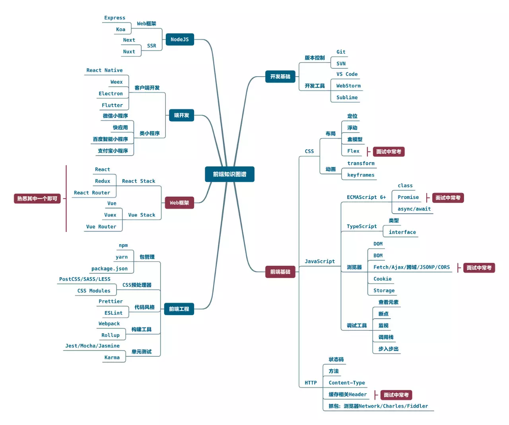

# 前端知识梳理

## JavaScript

### 浏览器
- [浏览器工作原理之网络](https://github.com/kongyufei5039/front-end-knowlege/issues/7)
- [浏览器工作原理之渲染引擎](https://github.com/kongyufei5039/front-end-knowlege/issues/10)
- [浏览器工作原理之JavaScript引擎](https://github.com/kongyufei5039/front-end-knowlege/issues/9)
- [浏览器工作原理之多进程架构](https://github.com/kongyufei5039/front-end-knowlege/issues/8)
- [浏览器工作原理之数据存储](https://github.com/kongyufei5039/front-end-knowlege/issues/11)
- [CORS 跨域访问机制理解](https://github.com/kongyufei5039/Front-end-Knowlege/issues/2)
### ECMAScript 6+
- [Class](https://github.com/kongyufei5039/front-end-knowlege/issues/3)
- [ES Module](https://github.com/kongyufei5039/front-end-knowlege/issues/4)
- [Promise](https://github.com/kongyufei5039/front-end-knowlege/issues/6)
## CSS
- [Flex](https://github.com/kongyufei5039/front-end-knowlege/issues/5)
